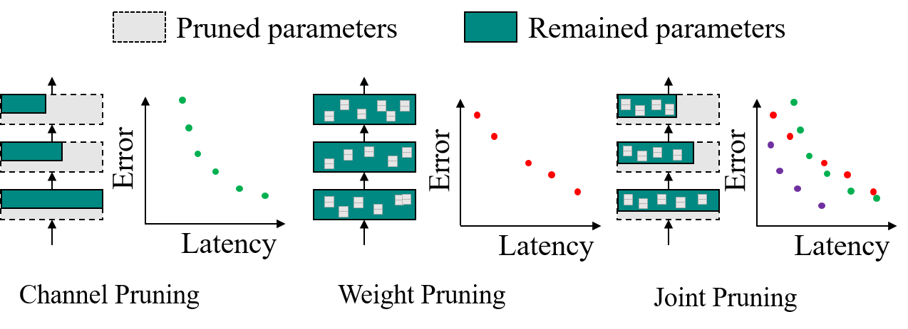
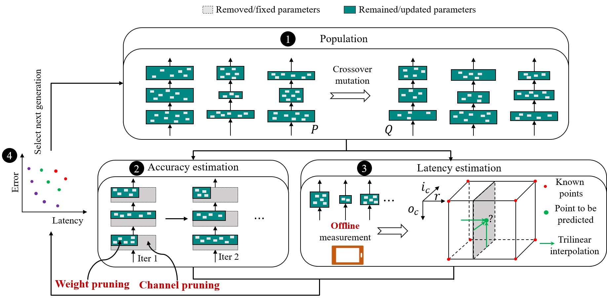

# Joint Channel and Weight Pruning for Model Acceleration on Mobile Devices



## Abstract
For practical deep neural network design on mobile devices, it is essential to consider the constraints incurred by the computational resources and the inference latency in various applications. Among deep network acceleration related approaches, pruning is a widely adopted practice to balance the computational resource consumption and the accuracy, where unimportant connections can be removed either channel-wisely or randomly with a minimal impact on model accuracy. The channel pruning instantly results in a significant latency reduction, while the random weight pruning is more flexible to balance the latency and accuracy. In this paper, we present a unified framework with **J**oint **C**hannel pruning and **W**eight pruning (JCW), and achieves a better Pareto-frontier between the latency and accuracy than previous model compression approaches. To fully optimize the trade-off between the latency and accuracy, we develop a tailored multi-objective evolutionary algorithm in the JCW framework, which enables one single search to obtain the optimal candidate architectures for various deployment requirements. Extensive experiments demonstrate that the JCW achieves a better trade-off between the latency and accuracy against various state-of-the-art pruning methods on the ImageNet classification dataset.

## Framework



## Requirements

  + torch
  + torchvision
  + numpy
  + scipy

## Usage
  
  The JCW works in a two-step fashion. i.e. the **search step** and the **training step**. The search step seaches for the layer-wise channel numbers and weight sparsity for Pareto-optimal models. The training steps trains the searched models with ADMM. We give a simple example for resnet18.

## The search step 

  1. **Modify the configuration file**

      First, open the file `experiments/res18-search.yaml`:
      ```shell
      vim experiments/res18-search.yaml
      ```
      Go to the 44th line and find the following codes:
      ```
      DATASET:
        data: ImageNet
        root: /path/to/imagenet
        ...
      ```
      and modify the `root` property of `DATASET` to the path of ImageNet dataset on your machine.

  2. **Apply the search**
      
      After modifying the configuration file, you can simply start the search by:
      ```shell
      python emo_search.py --config experiments/res18-search.yaml | tee experiments/res18-search.log
      ```
      After searching, the search results will be saved in `experiments/search.pth`

## The training step

After searching, we can train the searched models by:

  1. **Modify the base configuration file**

      Open the file `experiments/res18-train.yaml`:
      ```shell
      vim experiments/res18-train.yaml
      ```
      Go to the 5th line, find the following codes:
      ```
      root: &root /path/to/imagenet
      ```
      and modify the root property to the path of ImageNet dataset on your machine.

  2. **Generate configuration files for training**

      After modifying the base configuration file, we are ready to generate the configuration files for training. To do that, simply run the following command:
      ```shell
      python scripts/generate_training_configs.py --base-config experiments/res18-train.yaml --search-result experiments/search.pth --output ./train-configs 
      ``` 
      After running the above command, the training configuration files will be written into ./train-configs/model-{id}/train.yaml.

  3. **Apply the training**
      
      After generating the configuration files, simply run the following command to train one certain model:
      ```shell
      python train.py --config xxxx/xxx/train.yaml | tee xxx/xxx/train.log
      ```
